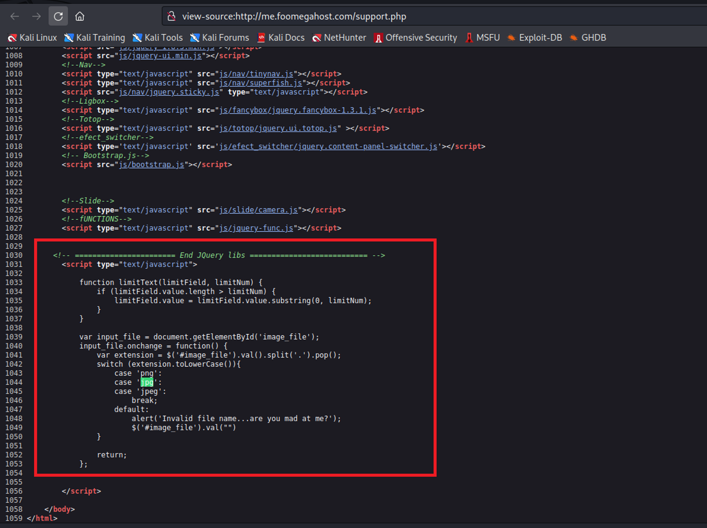

# Cross-site request forgery (CSRF)

## Summary

In this section, we will explore the root cause of CSRF attacks, how they can be launched, and some mitigation measures. While the use of CSRF tokens is a well-established practice for protection against CSRF attacks, the SameSite attribute is a lesser-known but effective defense-in-depth mechanism. However, deploying the SameSite attribute requires careful consideration to avoid consumer confusion caused by unexpected behaviors. You can refer to Udemy course on `Web Security: A Hands on Approach` by Prof Wenliang Du for detailed explanation on the CSRF attack.

## Cross-Site Request

When we use a browser, we often open multiple tabs and access different websites. If we send a request to a website from the same site, it is considered a same-site request. For example, if we access Facebook from one tab and send a request to Facebook from that tab, it is a same-site request. However, if we access a different website (a third-party site) in another tab and send a request to Facebook from that tab, it is called a cross-site request. The source and destination are not the same, which is why it is called a cross-site request.

### What leads to CSRF

If a request is made to example.com from a page within example.com, all the cookies belonging to example.com are automatically attached by the browser. Similarly, if a request is made to example.com from a different website, the browser still attaches the cookies. This lack of differentiation between same-site and cross-site requests can lead to Cross-Site Request Forgery (CSRF), where third-party websites are able to forge requests that are identical to same-site requests.

Attackers can take advantage of this by tricking users into clicking on a malicious link or visiting a malicious website. Once the user's browser loads the malicious page, the attacker's code can trigger a request to the target website, with the victim's session cookie attached. Since the session cookie is used to authenticate the session, the target website cannot distinguish between a legitimate request and a malicious one. The attacker can then carry out actions on behalf of the victim, such as making purchases or changing their account information.

### CSRF Attack Examples

#### GET Attack

The basic idea behind a CSRF attack on <mark style="color:red;">`GET`</mark> requests is that the attacker can place a piece of code, typically in the form of JavaScript, on their webpage. This code can then trigger GET requests using HTML tags like `img` or `iframe`, which can request the URL specified in the `src` attribute. The server will then respond with an image or webpage, as appropriate.

```html


<iframe
   src=src="http://www.example.com/transfer.php?to=3333&amount=1500">
</iframe>
```

#### POST Attack

In general, the attacker creates a malicious web page that includes a hidden form with pre-filled information. When the victim visits this web page, the form is automatically submitted in the background without their knowledge, and the attack is launched.

The classical form submission looks like following.

```html
<form action="/transfer.php" method="POST">
  <label>Name:</label>
  <input type="text" id="name" name="to"><br><br>
  
  <label>Amount:</label>
  <input type="text" id="amount" name="amount"><br><br>  
  
  <input type="submit" value="Submit">
</form>
```

The attacker can dynamically construct a page with a hidden form that is automatically submitted. The code below contains values for transferring money with a "to" account and "amount" and automatically submits it when the page is loaded.

```html
<!DOCTYPE html>
<html>
<head>
	<title>Auto-submit Form</title>
</head>
<body>
	<script>
		window.addEventListener('load', function() {
			var form = document.createElement('form');
			form.setAttribute('method', 'post');
			form.setAttribute('action', '/transfer.php');
			form.setAttribute('hidden', true);
			
			var input1 = document.createElement('input');
			input1.setAttribute('type', 'text');
			input1.setAttribute('name', 'to');
			input1.setAttribute('value', '3333');
			
			var input2 = document.createElement('input');
			input2.setAttribute('type', 'text');
			input2.setAttribute('name', 'amount');
			input2.setAttribute('value', '1500');
			
			var input3 = document.createElement('input');
			input3.setAttribute('type', 'submit');
			input3.setAttribute('value', 'Submit Form');
			
			form.appendChild(input1);
			form.appendChild(input2);
			form.appendChild(input3);
			
			document.body.appendChild(form);
			
			form.submit();
		});
	</script>
</body>
</html>

```

<figure><figcaption><p>The automatic submission of form data</p></figcaption></figure>

## Countermeasures

The root cause of a CSRF attack is the server's inability to differentiate between a same-site and a cross-site request. Although the browser knows which page initiates the request it does not convey that information to the server. This is a gap between the browser and the server. However, there is one piece of information that the browser sends to the server, called a `referrer` header. However, the `Referrer` header is not always reliable, as it can be easily modified or removed by the user's browser, or by intermediary systems such as proxies or firewalls. We will discuss some CSRF countermeasures in this section.&#x20;

### Secret Token approach

The idea is to hide a secret token inside a page, which is different from page to page. The server will verify whether the token is valid, and if not, the request will be rejected. To hide the secret token in the forms, hidden fields are provided. These fields will be automatically attached to the form when you send it out.&#x20;

The code below is a PHP implementation of CSRF protection using a randomly generated CSRF token with a validity of 60 seconds. The code generates a CSRF token and sets its expiry time in the user session. It also includes a function to validate the received CSRF token against the one stored in the session and checks its expiry time. If the token is valid, the code prints "Success!" upon form submission; otherwise, it prints "CSRF Token Validation Failed!". The code also includes a form with a hidden input field to store the CSRF token and a submit button.

```php
<?php
session_start();

function csrf_token() {
    if (!isset($_SESSION['csrf_token'])) {
        $_SESSION['csrf_token'] = bin2hex(random_bytes(32));
        $_SESSION['csrf_token_expiry'] = time() + 60; // 60 seconds validity
    }
    return $_SESSION['csrf_token'];
}

function validate_csrf_token($token) {
    if (!isset($_SESSION['csrf_token']) || !isset($_SESSION['csrf_token_expiry'])) {    
        return false;
    }
      
    if ($_SESSION['csrf_token'] !== $token || $_SESSION['csrf_token_expiry'] < time()) {
        return false;
    }
    unset($_SESSION['csrf_token']);
    unset($_SESSION['csrf_token_expiry']);
    return true;
}

if ($_SERVER['REQUEST_METHOD'] === 'POST') {
    $csrf_token = $_POST['csrf_token'] ?? '';
    if (validate_csrf_token($csrf_token)) {
        echo "Success!";
    } else {
        echo "CSRF Token Validation Failed!";
    }
    exit;
}
?>
<form method="post">
    <input type="hidden" name="csrf_token" value="<?php echo csrf_token(); ?>">
    <button type="submit">Submit</button>
</form>

```

<figure><figcaption><p>View Page Source</p></figcaption></figure>

<figure><figcaption><p>Request and Response</p></figcaption></figure>

### SameSite Attribute

The SameSite cookie attribute is an additional security feature that can be used to protect against CSRF attacks. This attribute can be added to cookies set by the server to restrict their scope, ensuring that they can only be sent in a first-party context.

A SameSite cookie can have three possible values: `Strict`, `Lax`, or `None`. If a cookie is set with the `Strict` value, it will only be sent in requests initiated by the same site as the one that set the cookie. If it is set with the `Lax` value, it will also be sent in cross-site requests that are deemed safe by the browser, such as GET requests for top level domains \[Refer [here](https://datatracker.ietf.org/doc/html/draft-ietf-httpbis-rfc6265bis-11#strict-lax)]. If it is set to `None`, the cookie can be sent in any context, including third-party contexts.

To gain insight into the behavior of cookies in cross-site requests, we will analyze the request and response of the website `www.example32.com`, which sets three cookies: `cookie-normal`, `cookie-lax`, and `cookie-strict`.

<figure><figcaption><p>Request and Response setting the cookies</p></figcaption></figure>

On the cross-site page `www.attacker32.com`, clicking the link will only show two cookies, `Normal` and `Lax`. The Strict cookie is not attached because it is a cross-site request. Submitting a GET request form will attach the Lax cookie, but the Strict cookie will still not be attached.

<figure><figcaption><p>Cross site GET request</p></figcaption></figure>

Submitting a POST request form will only attach the `Normal` cookie. This is because GET requests are usually used for retrieving information, and the `Lax` cookie can be helpful for that. POST requests are usually used for modifying information, so attaching cookies can be more damaging.&#x20;

<figure><figcaption><p>Cross site POST request </p></figcaption></figure>

### Considerations for SameSite Cookie

Reproduced from draft RFC on [Cookies: HTTP State Management Mechanism](https://datatracker.ietf.org/doc/html/draft-ietf-httpbis-rfc6265bis-11#top-level-navigations).

Setting the `SameSite` attribute in "strict" mode provides robust defense in depth against CSRF attacks, but has the potential to confuse users unless sites' developers carefully ensure that their cookie-based session management systems deal reasonably well with top-level navigations.[¶](https://datatracker.ietf.org/doc/html/draft-ietf-httpbis-rfc6265bis-11#section-8.8.2-1)

Consider the scenario in which a user reads their email at MegaCorp Inc's webmail provider `https://site.example/`. They might expect that clicking on an emailed link to `https://projects.example/secret/project` would show them the secret project that they're authorized to see, but if `https://projects.example` has marked their session cookies as `SameSite=Strict`, then this cross-site navigation won't send them along with the request. `https://projects.example` will render a 404 error to avoid leaking secret information, and the user will be quite confused.[¶](https://datatracker.ietf.org/doc/html/draft-ietf-httpbis-rfc6265bis-11#section-8.8.2-2)

Developers can avoid this confusion by adopting a session management system that relies on not one, but two cookies: one conceptually granting "read" access, another granting "write" access. The latter could be marked as `SameSite=Strict`, and its absence would prompt a reauthentication step before executing any non-idempotent action. The former could be marked as `SameSite=Lax`, in order to allow users access to data via top-level navigation, or `SameSite=None`, to permit access in all contexts (including cross-site embedded contexts).

## References:

1. Web Security: A Hands on Approach by Prof Wenliang Du and can be access on Udemy [here](https://www.udemy.com/course/web-security-du/).
